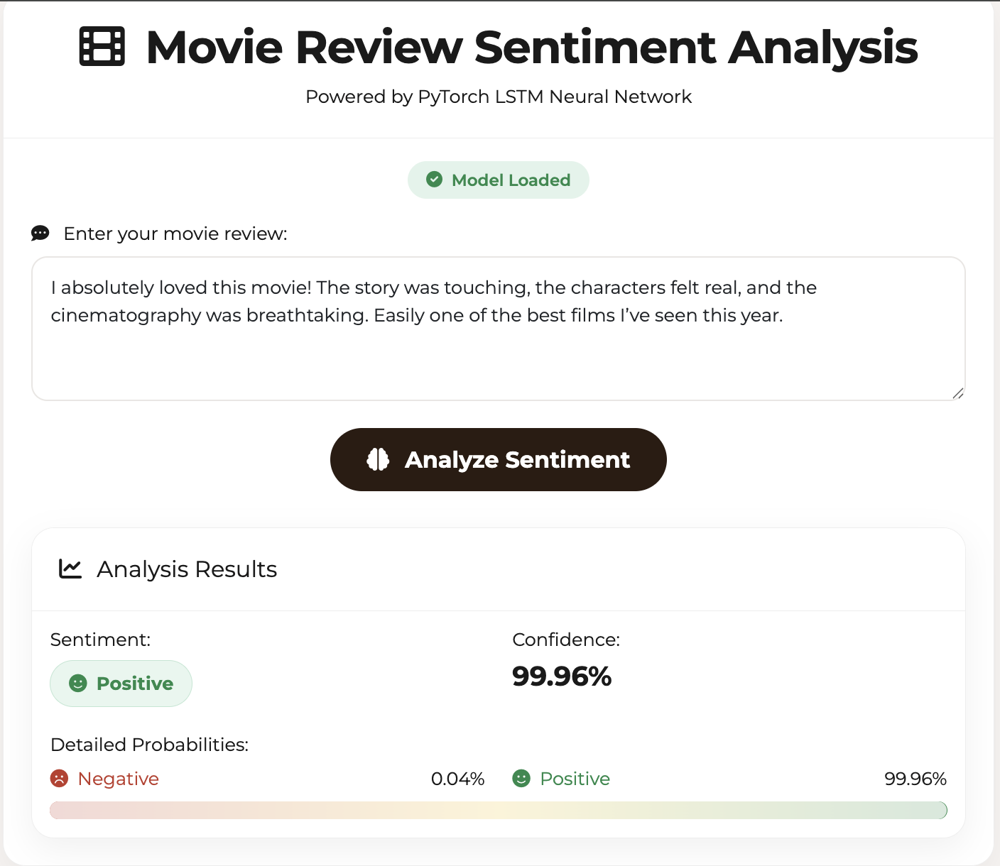
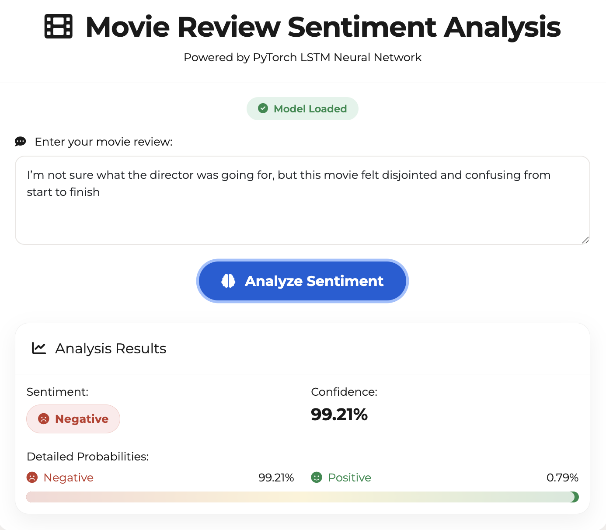
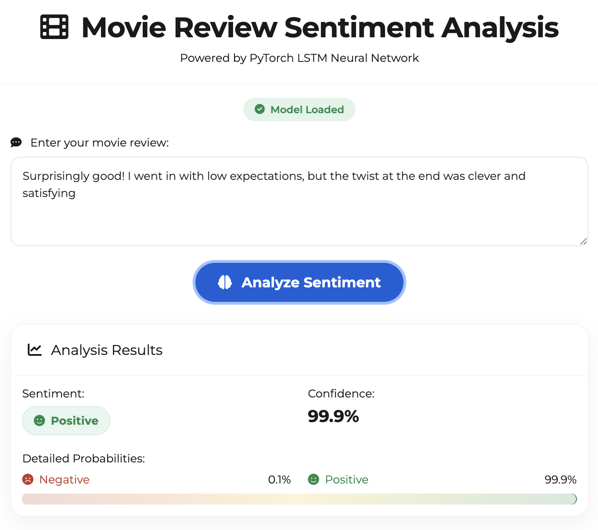
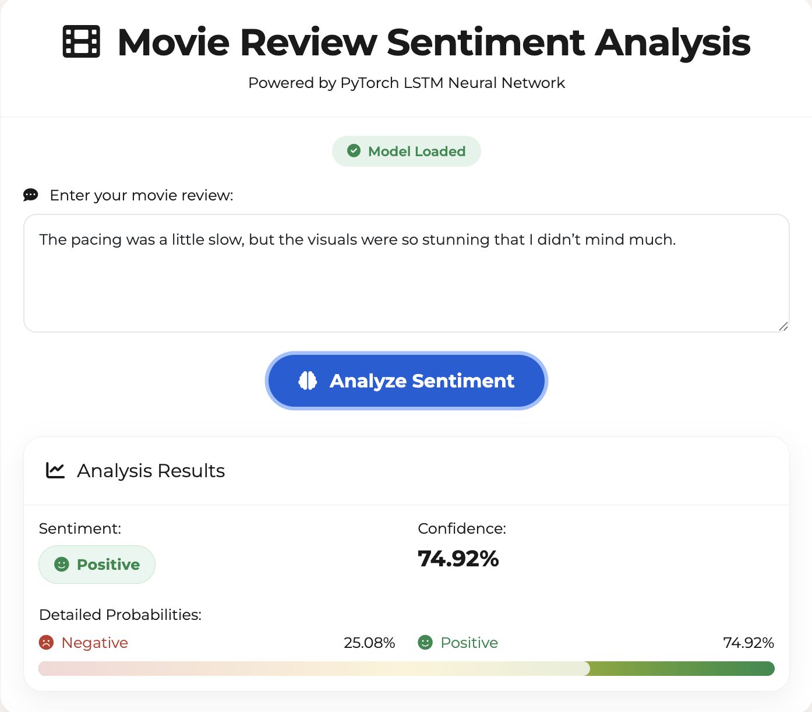

# Movie Review Sentiment Analysis (MapReduce + ML)

A comprehensive MLOps project for sentiment analysis of movie reviews using Apache Spark MapReduce and machine learning.

##  Demo

<div align="center">
  
  
</div>

<div align="center">
  
  
</div>

##  Project Overview

This project implements a complete MapReduce + ML pipeline for predicting movie review sentiment:

- **MapReduce Processing**: Single-pass feature extraction with word counts and TF-IDF
- **Machine Learning**: Naive Bayes, Logistic Regression, and Random Forest classifiers
- **MLOps**: MLflow tracking, model versioning, and evaluation metrics
- **Scalability**: Apache Spark for distributed processing

## 🏗️ Project Structure

```
MMS/
├── config/                 # Configuration files
│   └── config.yaml        # Main configuration
├── src/                   # Source code
│   ├── config/           # Configuration management
│   ├── data/             # Data loading utilities
│   ├── processing/       # MapReduce processing
│   ├── models/           # Model training and evaluation
│   └── utils/            # Utility functions
├── scripts/              # Executable scripts
│   ├── train.py         # Training script
│   ├── predict.py       # Prediction script
│   └── evaluate.py      # Evaluation script
├── tests/               # Unit tests
├── docker/              # Docker configuration
├── data/                # Data directory
├── models/              # Trained models
├── logs/                # Log files
├── artifacts/           # Model artifacts
└── mlruns/             # MLflow tracking
```

##  Quick Start

### 1. Installation

```bash
# Clone the repository
git clone <repository-url>
cd MMS

# Install dependencies
make install

# Setup project directories
make setup
```

### 2. Data Preparation

Place your movie review datasets in the `data/` directory:
- `train.csv` - Training data
- `test.csv` - Test data
- `unsupervised.csv` - Additional unsupervised data

### 3. Training

#### Spark MLlib Models
```bash
# Train with default settings
make train

# Train with cross-validation
make train-cv

# Train specific algorithm
python scripts/train.py --algorithm logistic_regression
```

#### PyTorch Neural Networks
```bash
# Train LSTM model
make train-lstm

# Train Transformer model
make train-transformer

# Train BERT model
make train-bert

# Train any PyTorch model
python scripts/train_pytorch.py --model-type lstm
```

#### Hybrid Training (Compare Both Approaches)
```bash
# Train both Spark and PyTorch models and compare
make train-hybrid

# Custom hybrid training
python scripts/train_hybrid.py --spark-algorithm naive_bayes --pytorch-model bert --compare
```

### 4. Prediction

#### Spark Models
```bash
# Predict single text
make predict

# Batch prediction
python scripts/predict.py --model-path models/naive_bayes_model --input-file data/test.csv --output-file predictions.csv
```

#### PyTorch Models
```bash
# Predict with PyTorch model
make predict-pytorch

# Custom PyTorch prediction
python scripts/predict_pytorch.py --model-path models/pytorch_lstm_model.pth --model-type lstm --text "This movie is great!"
```

### 5. Evaluation

```bash
# Evaluate model
make evaluate
```

## 🔧 Configuration

Edit `config/config.yaml` to customize:

- **Data paths**: Raw and processed data locations
- **Spark settings**: Memory, cores, and other Spark configurations
- **Text processing**: Stopwords, vocabulary size, feature extraction
- **Model parameters**: Algorithm, hyperparameters, cross-validation
- **MLOps settings**: MLflow tracking, logging, and artifacts

## 🐳 Docker Support

### Build and Run

```bash
# Build Docker image
make docker-build

# Run with Docker Compose
make docker-run
```

### Access Services

- **Spark UI**: http://localhost:4040
- **MLflow UI**: http://localhost:5000

##  Testing

```bash
# Run all tests
make test

# Run tests with coverage
make test-coverage
```

##  Processing Pipelines

### Spark MapReduce Pipeline
1. **Map Phase**: Tokenize text → emit (word, 1) pairs
2. **Reduce Phase**: Aggregate word counts → build vocabulary
3. **Feature Engineering**: TF-IDF + bag-of-words extraction
4. **Model Training**: Spark MLlib algorithms

### PyTorch Neural Network Pipeline
1. **Data Preprocessing**: Text cleaning and tokenization
2. **Vocabulary Building**: Word-to-index mapping
3. **Model Architecture**: LSTM/Transformer/BERT networks
4. **Training**: Gradient descent with early stopping

### Hybrid Approach
- **Best of Both Worlds**: Spark for data processing + PyTorch for deep learning
- **Performance Comparison**: Side-by-side evaluation of different approaches
- **Flexibility**: Choose the best model for your specific use case

## 🤖 Supported Models

### Spark MLlib Models
- **Naive Bayes**: Fast and effective for text classification
- **Logistic Regression**: Linear model with good interpretability
- **Random Forest**: Ensemble method for robust predictions

### PyTorch Neural Networks
- **LSTM**: Long Short-Term Memory networks for sequence modeling
- **Transformer**: Self-attention based architecture for text understanding
- **BERT**: Pre-trained transformer model for state-of-the-art performance

##  MLOps Features

- **MLflow Integration**: Experiment tracking and model versioning
- **Comprehensive Logging**: Structured logging with different levels
- **Model Evaluation**: Multiple metrics (accuracy, precision, recall, F1, AUC)
- **Cross-Validation**: Hyperparameter tuning with k-fold CV
- **Artifact Management**: Model and data versioning

##  Monitoring

### MLflow Tracking
- Experiment runs and parameters
- Model performance metrics
- Artifact storage and versioning

### Logging
- Structured logging to files and console
- Different log levels (DEBUG, INFO, WARNING, ERROR)
- Performance and error tracking

## 🛠️ Development

### Code Quality
```bash
# Format code
make format

# Type checking
make type-check
```

### Adding New Features
1. Create new modules in `src/`
2. Add corresponding tests in `tests/`
3. Update configuration in `config/config.yaml`
4. Add CLI options in scripts

## 📝 Usage Examples

### Training with Custom Parameters
```bash
python scripts/train.py \
    --algorithm naive_bayes \
    --cross-validate \
    --log-level DEBUG
```

### Batch Prediction
```bash
python scripts/predict.py \
    --model-path models/naive_bayes_model \
    --input-file data/new_reviews.csv \
    --output-file results/predictions.csv
```

### Model Evaluation
```bash
python scripts/evaluate.py \
    --model-path models/naive_bayes_model \
    --test-file data/test.csv
```

## 🤝 Contributing

1. Fork the repository
2. Create a feature branch
3. Make your changes
4. Add tests for new functionality
5. Run the test suite
6. Submit a pull request

## 📄 License

This project is licensed under the MIT License - see the LICENSE file for details.

## 🙏 Acknowledgments

- Apache Spark for distributed processing
- MLflow for MLOps capabilities
- The movie review dataset providers
- The open-source community for excellent tools and libraries
